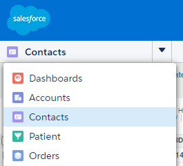
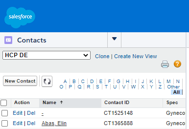
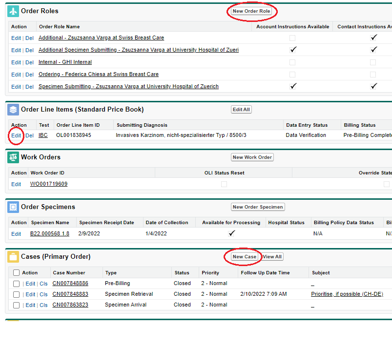
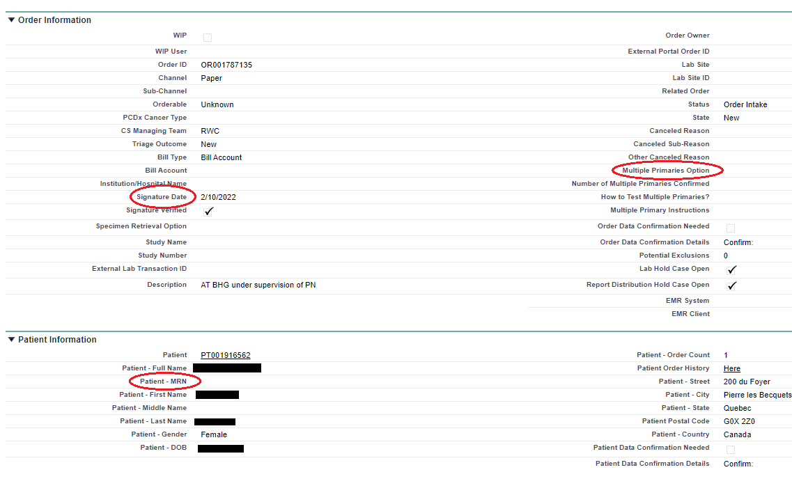
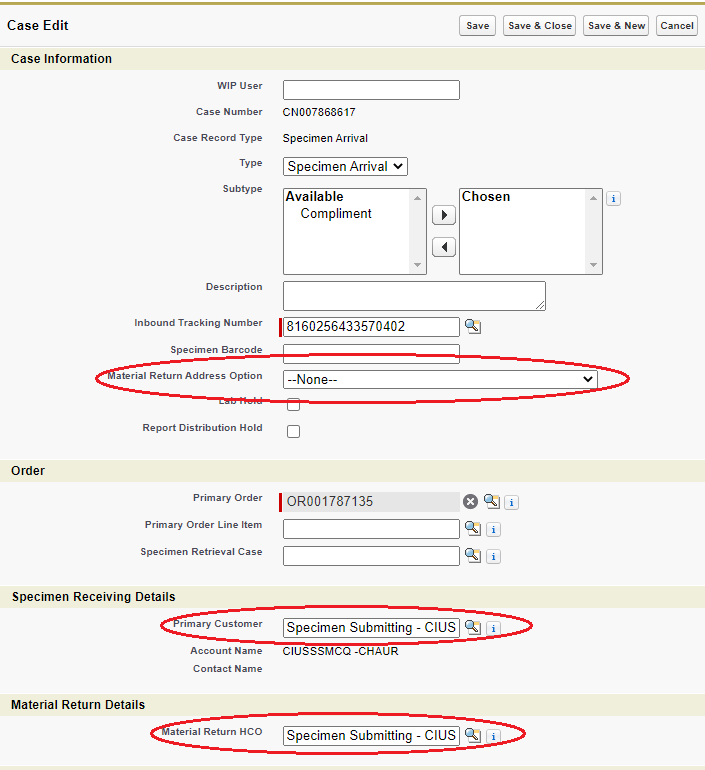
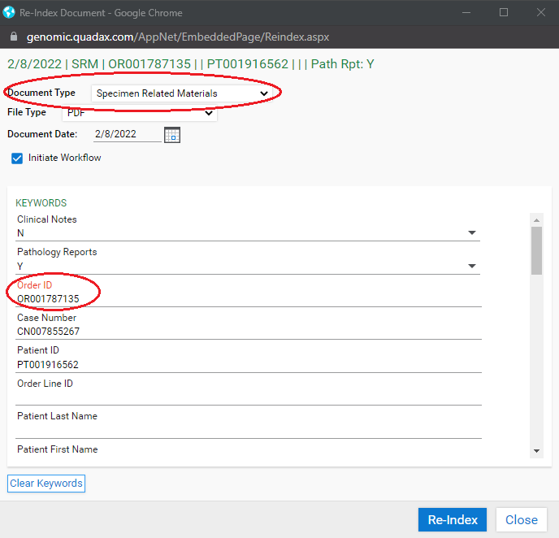
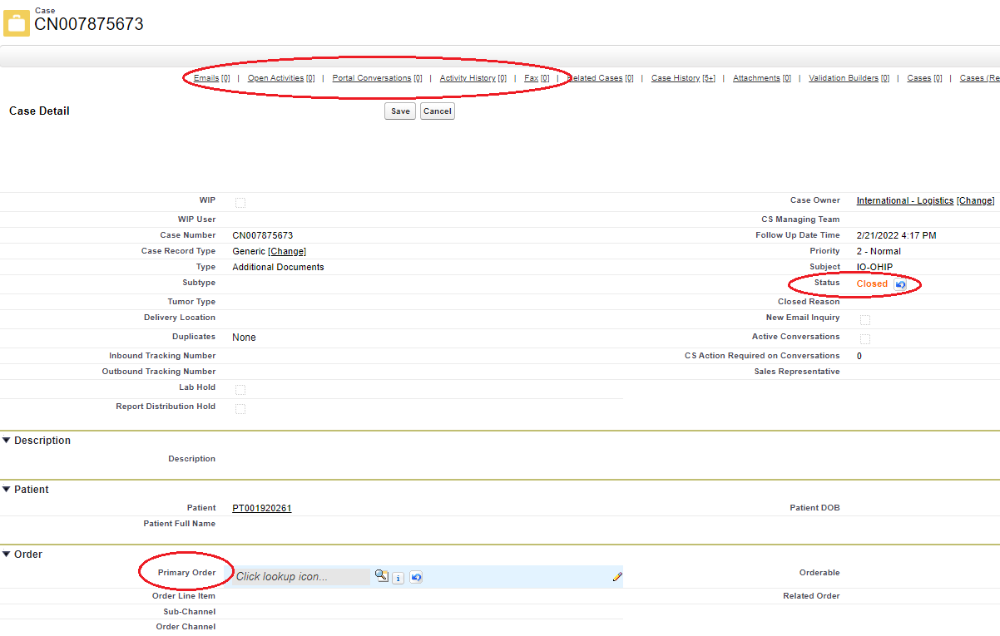
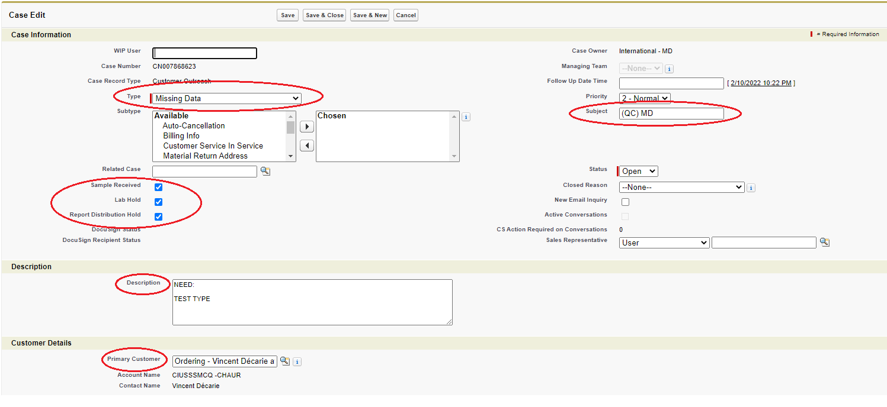

# Paper Orders

1. Check ESI on block/slides to order and path report
	- Find in path report: name, DOB, gender, ESI, DOC, diagnosis
	- If slides only have S barcode sticker, add "OK to proceed: S Barcode is physical identifier/ESI is per order form and to be used for reporting"  to notes section in LIMS
2. Duplicate patient search
	- First search: full name,  Second search: first three letters of first and last + * + year of birth
	- If order exists → go to **[Order Exists](#order-exists)**
	- If only patient exists → go to **[Contact Exists](#contact-exists)**
3. Create new Contact [Patient] 
	
	
4. `Order Entry Guide`
	- Channel = paper Triage = new Bill type = per order Description = AT *your initials*
5. Create Order Roles 
	
	- **Ordering**: find approved account via CR#, fax, address, or hospital name Need approved contact (oncologist)
	- **Specimen Submitting**: find approved account via same method Need approved contact (pathologist) If not provided on order form → same as Ordering
	- **Material Return**: only required if different account from Specimen Submitting Priority: given on order, specific paper provided, 2/3's rule (match between specimen submitting, air bill, and path report)
	- Check each account for notes
6. Edit each Order role
	- Select appropriate address affiliation, ensure phone and fax match order form
7. Create Specimen Arrival Case
	- Required data: tracking number, specimen receiving - primary customer [specimen submitting], material return
8. Edit Order Line Item
	- ICD code defaults: female = C50.919, male = C50.929
		- Not required for Bill Account
	- Submitting diagnosis
	- ER status, Node status
9. Edit Order Details
	- Signature date, multiple primaries option, MRN 
10. `Order Intake Complete`, `LIMS Accessioning`
11. Enter data into LIMS
	- ESI, tracking number, number of stuff [blocks/slides], container code, DOC
12. Print two O-Barcode Labels and Accession
	- Place one O-barcode on the folder and one on the order form
	- Place the other sticker(s) on the block/slides
13. Close LIMS before starting next sample

### Order Exists

1. Go to `Order Intake` dropdown
	- Enter order number and tracking number, search
2. `Process Case` [Specimen Arrival]
	- Need tracking number, primary customer, and material return
	- Can select material return from dropdown if same as primary customer 
3. Ensure there are other no open cases
4. LIMS Accessioning
	- ESI, tracking number, number of stuff [blocks/slides], container code, DOC

### Contact Exists

1. Check and enter any missing patient information
2. `Order Entry Guide`
	- Channel = paper, Triage = new, bill type = per order, description = AT `initials`
3. `Electronic Documents`
	- Check that all information matches with appropriate patient
	- `Re-index` Select Specimen Related Materials from document type dropdown Enter order number 
	- Open the Case, add the OR number to primary order Ensure that there are no items from left of `Fax` If nothing, close the case. Else, leave open 
4. Continue from Step 5 above [Return to top](#paper-orders)

### Missing Data Cases

1. If any data required above is not found on the order form or does not match the path report, create a MD case
2. Create new case [Customer Outreach]
	- Type defaults to Missing Data
3. Check `Sample Received` and `Report Distribution Hold`
	- If missing data issue is ESI, test type, or patient DOB discrepency, check `Lab Hold`
	- If on hold, add "*number of stuff* (*ESI*) on hold in Intellicab" to `Activity History` tab of Case Place in red folder, then in Sample Holds to Be Scanned bin
	- Example:
	> 15 USS (S22-123-A1) on hold in Intellicab 
	> 1 blk (S22-123-A2) on hold in Intellicab
4. Enter the issue into the `Description`
	- Always start with "NEED:" followed by one blank line
	- Example: 
	> NEED:
	>
	> CONF PT NAME 
	> John Doe per order vs Jane Doe per PR
5. Enter info into the `Subject`
	- Format: (*province*) *case type*
	- Example 
	> (QC) MD
6. Select primary customer
	- Typically ordering Order Role
7. Save and change `Case Owner` to Queue
	- Need select appropriate queue, such as *International - MD*
