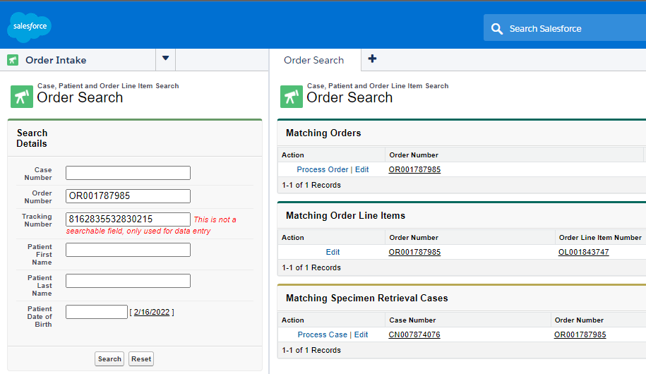

# Intl Order Processing

Refer to *SOP-0191 Specimen Materials Processing and Accessioning* and *SOP-OP-PA-03-021 International Order and Material Processing* for official instructions

## Paper Orders

**All information on the order form should be entered into SFDC at some point during the accessioning process**

1. Compare ESI on block/slides to req and path report
	- Find in path report: name, DOB, gender, ESI, DOC, subdx
	- If slides only have S barcode sticker, add to notes section in LIMS "OK to proceed: S Barcode is physical identifier/ESI is per order form and to be used for reporting"
2. Duplicate patient search
	- First search: full name,  Second search: first 3-4 letters of first and last + * + year of birth
	- If order exists → go to **[Order Exists](#order-exists)**
	- If only patient exists → go to **[Contact Exists](#contact-exists)**
	- Example:
	> Patient: John Smith (01/01/1964), Search "joh* smi* 1964"
3. Create new Contact [Patient] 
	- Enter all information in the Patient Information section of the req 
	
	
4. `Order Entry Guide`
	- Channel = paper Triage = new Bill type = per order Description = AT [*your initials*]
5. Create Order Roles 
	
	- **Ordering**: find approved account via CR#, fax, address, or hospital name Need approved contact (oncologist)
	- **Specimen Submitting**: find approved account via same method Need approved contact (pathologist) If not provided on order form → same as air bill
	- **Material Return** [optional]: only required if different account from Specimen Submitting Priority: given on order, specific paper provided, 2/3's rule (match between specimen submitting, air bill, and path report)
	- Check each account for relevant notes
6. Edit each Order role
	- Select appropriate address affiliation, ensure phone and fax match order form
7. Create Specimen Arrival Case
	- Required data: tracking number, specimen receiving - primary customer [specimen submitting], material return
	- Can select material return from dropdown if same as primary customer 
8. Edit Order Line Item
	- ICD code only required field for Private Insurance Bill type
		- Defaults:
		- IBC: female = C50.919, male = C50.929
		- DCIS: D05.90
		- Colon: C18.9
		- Prostate: C61
	- Submitting diagnosis
	- ER status, Node status
9. Edit Order Details
	- Signature date, multiple primaries option, MRN 
10. `Order Intake Complete`, `LIMS Accessioning`
11. Enter data into LIMS
	- ESI, tracking number, number of stuff [blocks/slides], container code, DOC
	- If slides do not have an ESI, put "OK to proceed: S Barcode is physical identifier/ESI is per order form and to be used for reporting" in Add Comment section
12. Print two O-Barcode Labels and Accession
	- Place one O-barcode on the folder and one on the order form
	- Place the other sticker(s) on the block/slides
13. Close LIMS before starting next sample

## Order Exists

Possible outcomes of existing order:
<ol type="a">
	<li>Order is processing → <a href="#order-intake">Order Intake<a/></li>
	<li>Order is a failure → <a href="#resubmission">Resubmission<a/></li>
	<li>Order is closed and 6+ weeks old → Multiple Specimen → Place in yellow folder</li>
	<li>Order is closed and less than 6 weeks old → Potential Duplicate → Create order and place sample on hold</li>
</ol>

#### Order Intake
Should already have the OR number printed at the top of the order form
1. Go to `Order Intake` from dropdown on left panel
	- Enter order number and tracking number, Search 
2. `Process Case` [Specimen Retrieval]
	- Need tracking number, primary customer, and material return
3. Ensure there are no other open cases
4. LIMS Accessioning
	- ESI, tracking number, number of stuff [blocks/slides], container code, DOC

#### Resubmission
1. Open the existing order and ensure a failure case exists
2. Open the failure case, change `Status` to Open and `Priority` to High
3. Open OLI, scroll down and click `Resubmission`
4. Create a new Specimen Arrival case
5. `LIMS Accessioning` [Return to top](#intl-order-processing)

## Contact Exists

1. Double check that there are no orders associated with this patient
2. Verify data and enter any missing patient information
3. `Order Entry Guide`
	- Channel = paper, Triage = new, bill type = per order, description = AT *initials*
4. `Electronic Documents`
	- Check that all information matches with appropriate patient
	- `Edit` → `Re-index` Select *Specimen Related Materials* from document type dropdown Enter order number 
	- Open the Case, add the OR number to primary order Ensure that there are no items from left of `Fax` If all items show [0], change `Status` to Closed. Else, leave open 
5. Continue from Step 5 above [Return to top](#intl-order-processing)

## Missing Data Cases

1. If any data required above is not found on the order form or does not match with the path report, create a MD case
2. Create new case [Customer Outreach]
	- Type defaults to Missing Data
3. Check `Sample Received` and `Report Distribution Hold`
	- Check `Lab Hold` and hold the sample for any discrepency with ESI, test type, patient DOB, or patient name
	- If on hold, create `New Note` in `Activity History` tab of Case Add "*number of stuff* rcvd (*ESI*) on hold in Intellicab" as subject Place in red folder, then in Sample Holds to Be Scanned bin
	- Example:
	> 15 USS rcvd (S22-123-A1) on hold in Intellicab 
	> 1 blk rcvd (S22-123-A2) on hold in Intellicab
4. Enter the issue into the `Description`
	- Always start with "NEED:" followed by one blank line
	- Example: 
	> NEED:
	>
	> CONF PT NAME 
	> Per req: John Doe Per PR: Jane Due
5. Enter info into the `Subject`
	- Format: (*country/province/partner code*) *case type*
	- Example 
	> (QC) MD
6. Select primary customer
	- Typically ordering Order Role
7. Save and change `Case Owner` to appropriate queue
	- `International MD` for Asia, Pacific, Latin America, and Canada
	- `International Logistics` for missing OHIP or RAMQ
	- `Geneva MD` for any Europe, Middle East, or Africa
 [Return to top](#intl-order-processing)

## Country Specific Notes
| Country | Case Code | Billing | Notes |
| :--- | :---: | :--- | :--- |
| Ontario, Canada | ON | private insurance | Need OHIP approval paperwork, if missing create MD case to INTL Logistics |
| Quebec, Canada | QC | bill acct | Need RAMQ + 2 signatures, if missing create MD case to INTL Logistics |
| rest of Canada | AB, BC, NL, NS, NB, MB, PE, SK | bill acct | N/A |
| Singapore | SG | patient pre-pay | mat return to Hardy Cheung (CR012078) |
| Malaysia | MY | patient pre-pay | mat return to Hardy Cheung (CR012078) |
| Hong Kong | Jacobson | bill acct | Partner is Jacobson (CR008894), addtl report rcvr Minne Wong (CT023976) |
| Middle East + Northern Africa | NBP | bill acct | Partner is Newbridge (CR008898), addtl report rcvd Suzette Azar (CT030636) |
| South Africa | RSA | bill acct | Partner is PharmaCentrix (CR008871), cannot return specs unless from QLab |
| Spain | ES | bill acct | Partner is Palex (CR008874), mat return MUST be Palex |
| Portugal | PT | bill acct | Partner is Palex (CR008874), mat return MUST be LusoPalex (CR008876) |
| Korea | BMS | bill acct | ESI is always per req |
| European Union | n/a | n/a | Patient info must be deidentified. Only IBC orders (except for studies) |  
[Return to top](#intl-order-processing)